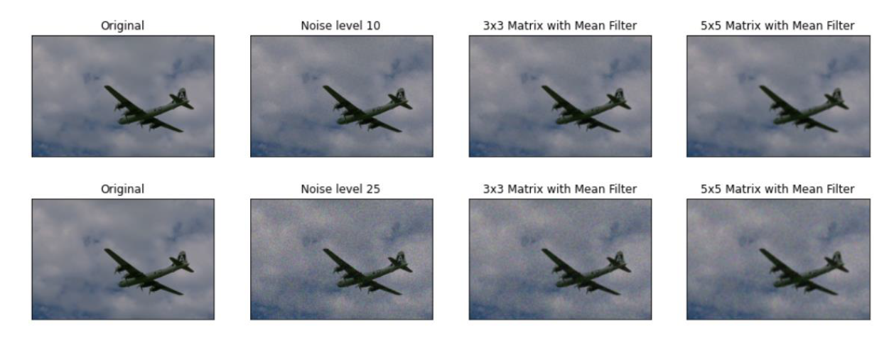

## Algorithm For Image Denoising

### Mean Filter
Mean filtering is an easy-to-understand and -implement technique for smoothing pictures by minimising the intensity differences between neighbouring pixels. It's a common method for cleaning up pixelated photos.

### Median Filter
This is a non-linear filter that uses the function cv2.medianBlur() in OpenCV to calculate the median of all the pixels under the kernel region and replace the element with this value

### Wavelet Denoising
The amplitude of a wavelet starts at zero, grows or shrinks, and then cycles back to zero one or more times. [1]

### Pre trained Model - Restormer
The Restormer is pre trained model for picture denoising.

### References
[1] "Wavelet" https://en.wikipedia.org/wiki/Wavelet
